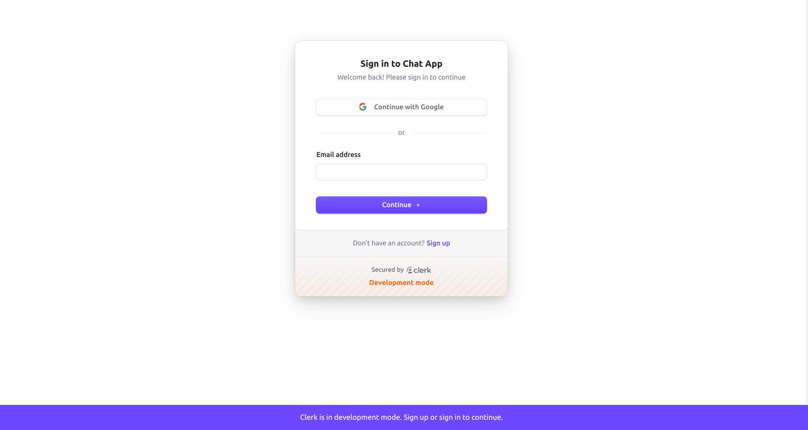
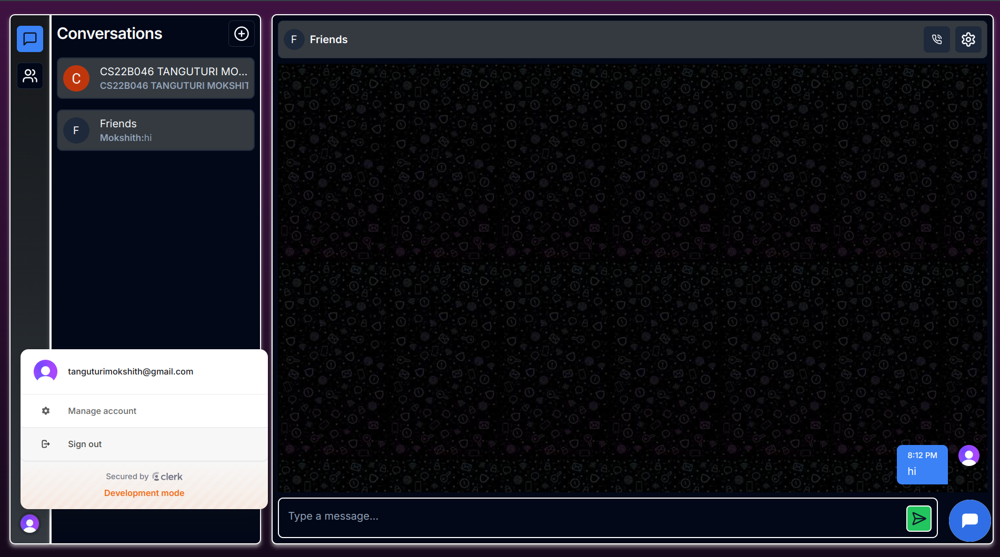
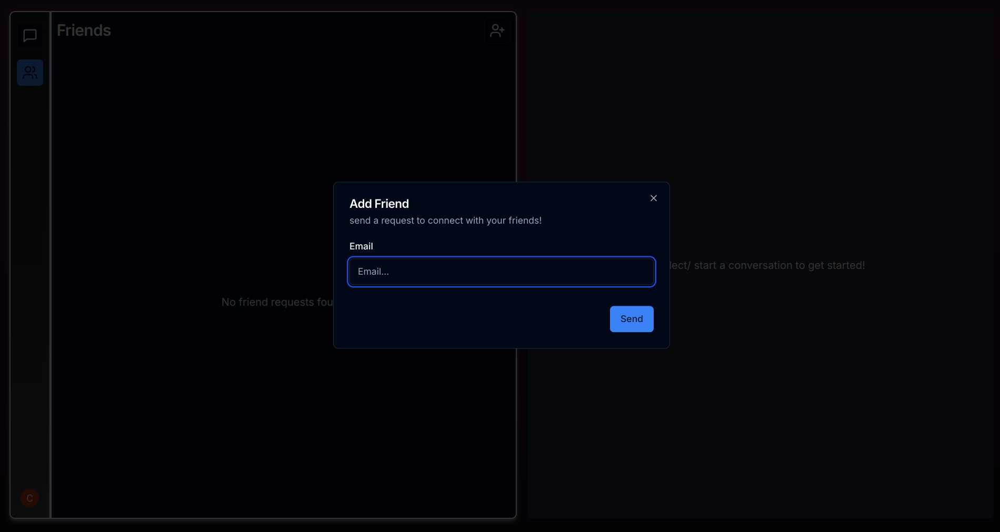
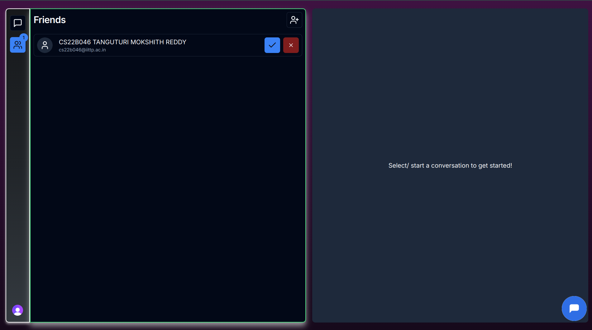
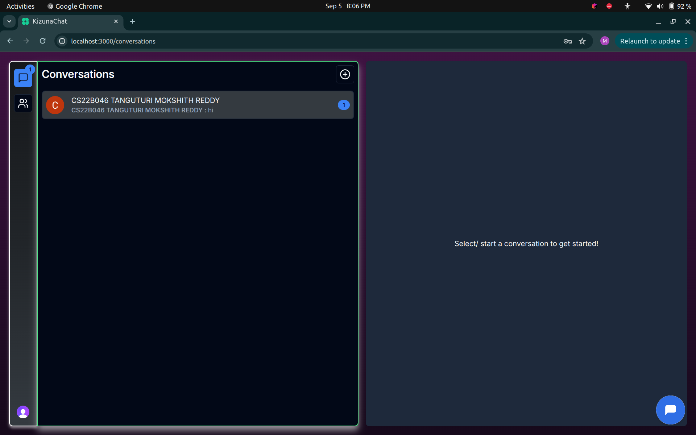
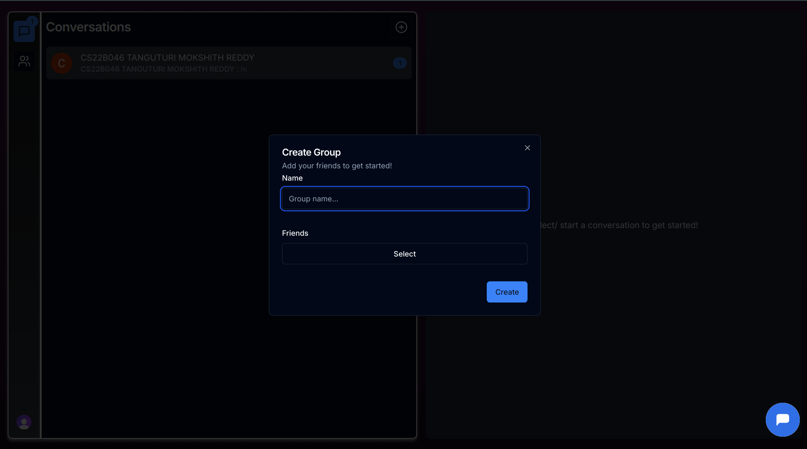
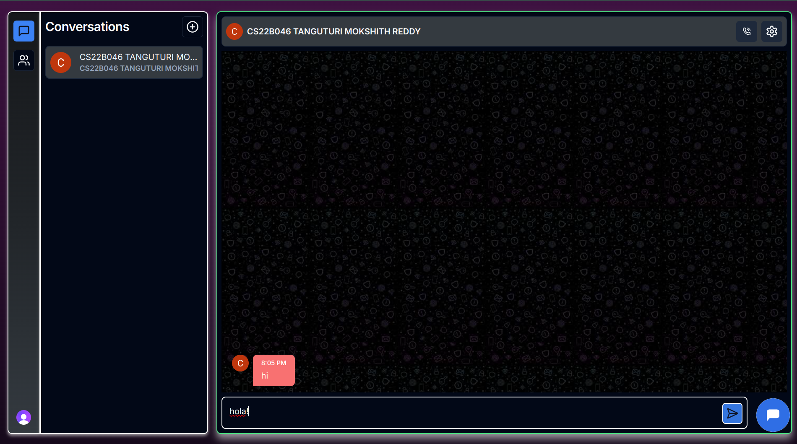
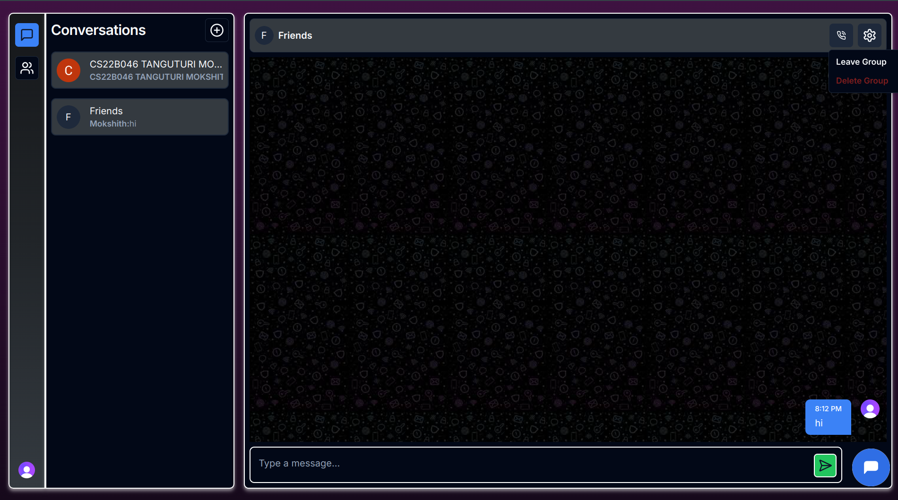
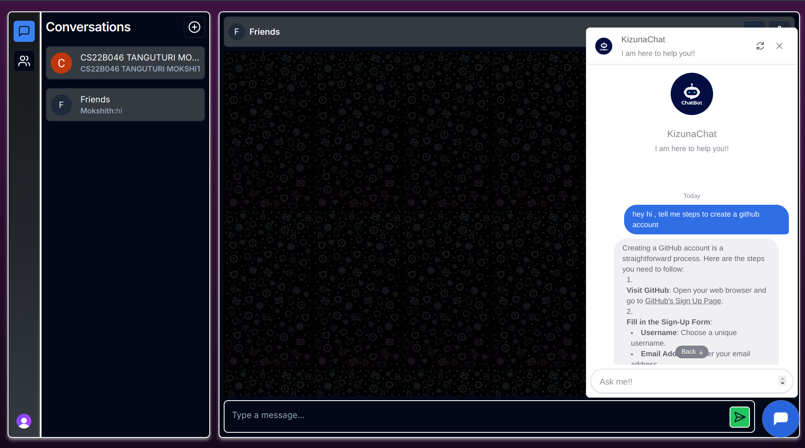
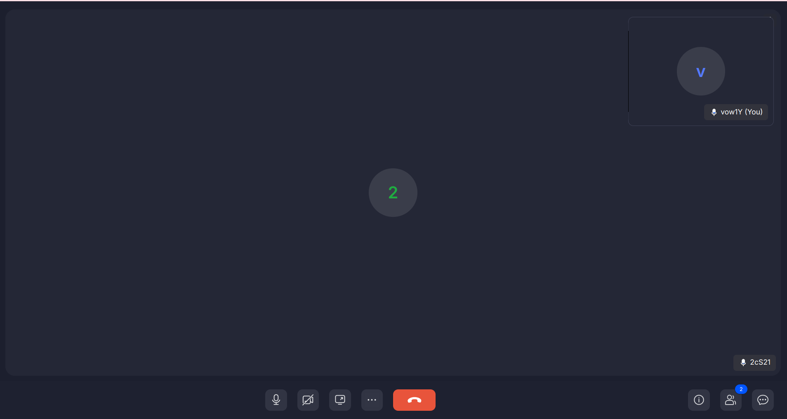

# KizunaChat - A Messaging Service Prototype Web App

KizunaChat, derived from 'kizuna' (connect or bond in Japanese), is a web-based chat application designed to connect users. It is a messaging service prototype featuring user authentication, real-time messaging, group chat, and optional features such as AI-powered chatbots and video/audio calls.

## Table of Contents

- [Features](#features)
- [Technology Stack](#technology-stack)
- [Installation](#installation)
- [Usage](#usage)
- [System Design](#system-design)
- [Optional Features](#optional-features)
- [Deployment](#deployment)
- [Contributing](#contributing)

## Features

- **User Registration & Authentication**: Secure user sign-up and login.
- **Text Messaging**: Real-time messaging between users.
- **Group Chat**: Create and join group conversations.
- **Real-time Updates**: Instant message delivery and notifications.
- **AI-Powered Chatbot**: An AI chatbot for user interaction.
- **Video/Audio Calling**: Real-time video and audio calls.

## Technology Stack

### Frontend

- **Framework**: [Next.js](https://nextjs.org/) - A React framework for server-side rendering and static site generation.
- **UI Libraries and Components**:
  - [Radix UI](https://www.radix-ui.com/) - Accessible and customizable UI components.
  - [Tailwind CSS](https://tailwindcss.com/) - Utility-first CSS framework for custom designs.
  - [Lucide React](https://lucide.dev/) - React components for Lucide icons.
  - [React Spinners](https://www.npmjs.com/package/react-spinners) - Loading spinner components.
  - [Shadcn/UI](https://shadcn.dev/) - Reusable components and theming.
- **Form Handling**:
  - [React Hook Form](https://react-hook-form.com/) - Managing form state and validation.
- **Chatbot Integration**:
  - [Botpress Webchat](https://botpress.com/) - Integrating Botpress chatbots.
- **Real-time Communication**:
  - [ZEGOCLOUD UIKit](https://www.zegocloud.com/) - Prebuilt UI components for video and audio calling.
- **Utilities**:
  - [Date-fns](https://date-fns.org/) - Date manipulation.
  - [CLSx](https://www.npmjs.com/package/clsx) - Utility for class names.
  - [Sonner](https://www.npmjs.com/package/sonner) - Notification library.
- **Form Validation**:
  - [Zod](https://zod.dev/) - TypeScript-first schema validation library.

### Backend

- **Convex DB**: Utilized for real-time data management and synchronization. Convex simplifies handling data interactions by integrating directly with the frontend, providing efficient real-time updates and reactive features.
  - **Real-Time Data Management**: Handles data synchronization and real-time updates, reducing the need for traditional backend services.
  - **Integration**: Directly integrated with the frontend for streamlined data handling and communication.

- **Clerk** - Authentication service for user management and security.

## Installation

1. **Clone the Repository:**

    ```bash
    git clone https://github.com/Mokshith1708/KizunaChat
    cd KizunaChat
    ```

2. **Install Dependencies:**

    (Note: Ensure you have Node.js version v22.8.0 installed)
    ```bash
    npm install
    ```

3. **The Project is also Deployed:**
    Project can be accessed at "https://kizuna-chat.vercel.app/conversations"

## Usage

1. **Start the Backend Server:**

    ```bash
    npx convex dev
    ```

2. **Start the App:**

    ```bash
    npm run dev
    ```

3. **Open the Application:**
   After running `npm run dev`, a link will be displayed in the terminal. Copy and paste this link into your browser to access the application.

4. **Login or Sign Up:**
   To use the application, you need to create an account. You can sign up using either:
   - Google account
   - Email and password
   
   After signing up, you can log in using your email and password or Google account credentials.

   

5. **Navigation Bar:**
   The navigation bar on the left side allows you to switch between friends and conversations, view user details, and log out.
   

6. **Friends Page:**
   Add friends by entering their email addresses. Ensure the friend has a KizunaChat account. You can test this by opening another browser or using a different account.
    


7. **Accept or Reject Friend Requests:**
   Manage friend requests on the Friends page. You will see requests and can accept or reject them accordingly.
   

8. **Conversations:**
   View all friends and groups. Notifications for unread messages are indicated. Clicking on notifications takes you to the chat window.
    

9. **Group Creation:**
   Create a new group by clicking the symbol in the top right corner of the Conversations page. Enter the necessary details and click "Create."
   

10. **Chat Option:**
    Click on a person or group to open the chat window. You can view all messages with timestamps. Use the top bar for calling and settings options.
    
    


11. **Chatbot:**
    Access the AI-powered chatbot by clicking the message symbol on the leftmost corner of the page. The chatbot can answer general questions.
    

12. **Calling Feature:**
    Use the call option in the menu to initiate a call. Note that there is no notification system for incoming calls; both users need to manually join the call.
    

## System Design

A comprehensive system design document is available in the [docs/SystemDesign.md](docs/SystemDesign.md). It includes architecture diagrams, component descriptions, and data flow.

## Optional Features

### AI-Powered Chatbot Integration
Integrated a ChatGPT-based bot from Botpress Webchat through APIs for general interaction.

### Video/Audio Calling
Integrated ZEGOCLOUD UIKit for video and audio calling. Note that the integration is limited to a certain amount of call time.

## Deployment
Guess what the project is deployed!! the project can be accessed at "https://kizuna-chat.vercel.app/conversations"
. 

## Contributing

To contribute:

1. Fork the repository.
2. Create a new branch: `git checkout -b feature/your-feature`.
3. Make your changes and commit: `git commit -am 'Add new feature'`.
4. Push to the branch: `git push origin feature/your-feature`.
5. Create a pull request.
